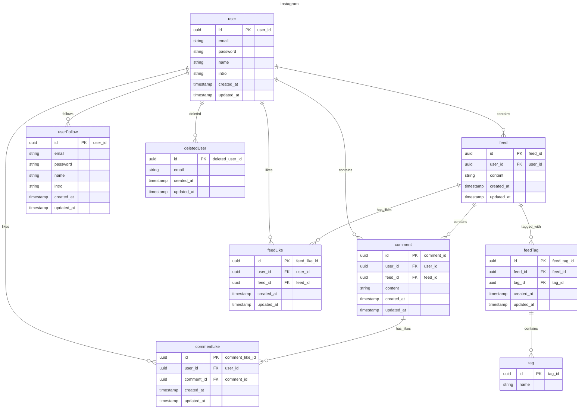

# 뉴스피드 프로젝트

뉴스피드 어플리케이션 협업 프로젝트

## 프로젝트 목표

- `Spring Boot`를 이용한 REST API 구현
- `JPA`를 활용한 `CRUD`과 데이터베이스와 연동
- `Cookie/Session`을 활용한 인증/인가
- 형상관리 툴(`Git`)을 이용한 소스 코드 버전 관리 및 협업 경험

## 팀원 소개

| 팀장  | 팀원  | 팀원  | 팀원  |
|:---:|:---:|:---:|:---:|
| 김효중 | 강유진 | 조민재 | 홍승근 | 

## 기술 스택

- `backend`
    - `Java`, `SpringBoot`, `gradle`, `Spring Data JPA`, `QueryDSL`, `MySQL`
- `Tool`
    - `IntelliJ`, `Github`, `Notion`, `Slack`

## 기능 소개

- 유저
  - 회원가입, 로그인
  - 다른 유저를 팔로우 할 수 있다
  - 이름으로 유저를 검색할 수 있다
- 피드
  - 다른 사람의 글을 확인할 수 있다
    - 팔로우한 사람이 있다면 팔로우한 사람의 글을 모아 볼 수 있다
  - 피드에 좋아요를 누를 수 있다
  - 좋아요가 많은 순서, 기간 별 검색, 태그 등을 통한 필터 검색을 할 수 있다
- 댓글
  - 다른 사람의 피드에 댓글을 남길 수 있다
  - 댓글에 좋아요를 누를 수 있다

## ERD

